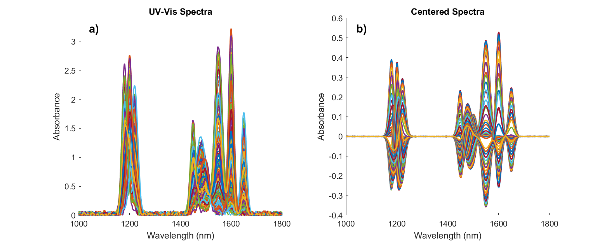

# IR Spectral Analysis of Pharmaceutical Tablets

This repository presents the results of a Principal Component Analysis (PCA) on infrared (IR) absorbance spectra collected from 150 pharmaceutical tablets. The objective is to assess the consistency of chemical composition across different production batches, ensuring quality and compliance with manufacturing specifications.

---

## 🧪 Context

- **Samples**: 150 pharmaceutical tablets from various production batches  
- **Measurement**: IR absorbance spectra  
- **Known references**:  
  - API (Active Pharmaceutical Ingredient)  
  - EXC1 (Excipient 1)  
  - EXC2 (Excipient 2)  

Due to limitations in physical and imaging-based analysis, spectroscopic methods (such as IR) are used as the primary tool for chemical characterization.

---

## 🎯 Objective

To characterize the compressed powder inside each tablet and determine whether chemical composition is consistent across all samples — a critical aspect of pharmaceutical quality assurance.

---

## 🔍 Analysis Overview

### 1. **Raw and Centered IR Spectra**

  

- **Left**: Raw absorbance spectra for the 150 tablets. Variability indicates potential differences in composition across batches.
- **Right**: Centered spectra reveal the subtle differences in absorbance, highlighting patterns for PCA.

---

## 📈 Covariance Structure and Reference Spectra

  

- **Left – Covariance Matrix**:  
  Highlights regions of strong co-variation around 1200 nm, 1500 nm, and 1600 nm. These zones likely correspond to key features of the API and excipients.

- **Right – Mean Spectrum with Reference Spectra**:  
  The red line shows the mean spectrum across all tablets, with pink shading representing ±1 standard deviation.  
  Reference spectra are overlaid:
  - **API** (purple)  
  - **EXC1** (green)  
  - **EXC2** (cyan)  
  Matching peaks confirm that the sample spectra are driven by these three known components. Variation suggests some batch-to-batch differences in concentration.

---

### 3. **Scree Plot and Score Distribution**

  

- **Scree Plot (Left)**:  
  - PC1 explains the majority of the variance  
  - PC2 captures substantial secondary variance  
  - The first 2–3 PCs are sufficient to describe most of the structure in the dataset

- **reference Spectra and Principal Component Loadings (Right)**:
  - Reference spectra of API, EXC1 and EXC2
  - Plot of the two principal components
  

---

### 4. **Spectral Variability Along Principal Components**

  

**Score Plot**: 
  - Projection of all 150 tablets in the PC1–PC2 space  
  - Potential clustering suggests differences among batches or compositions

---

## 💡 Key Takeaways

- Most spectral variance is captured by the first few principal components.
- The IR spectral analysis suggests some variability across tablet batches, potentially in API or excipient concentrations.
- PCA wasn't able to quick detect  batch-level differences.
- Data were created by generative AI and the spectra used to perform the analysis were a random combination of the three reference spectra, therefore PCA performance was compromised 

---
